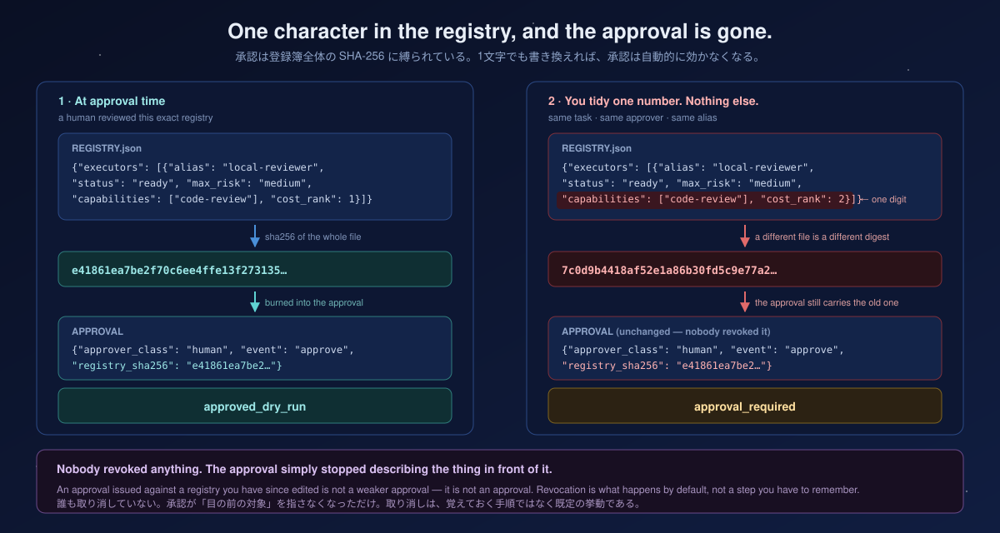
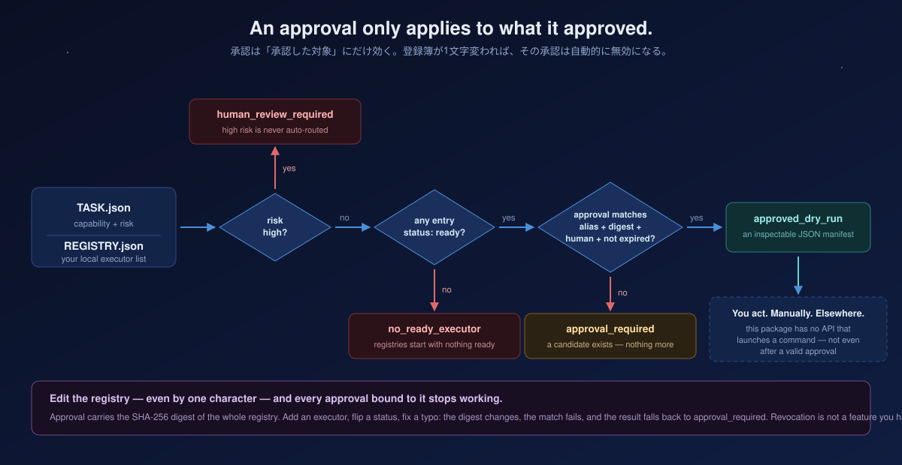
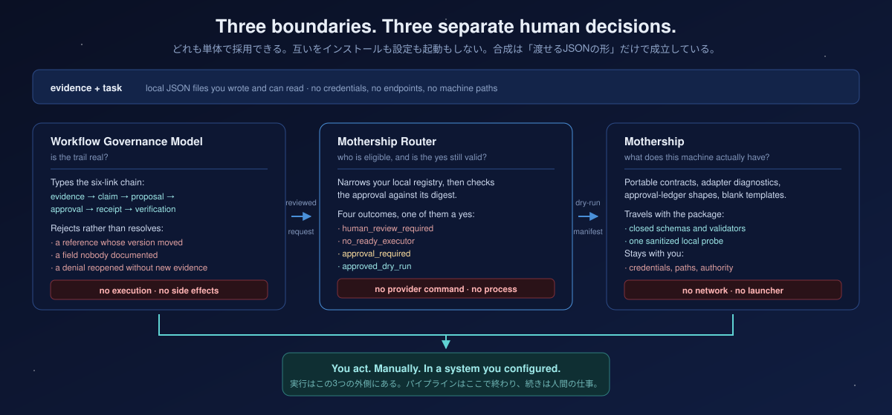

<p align="center">
  
</p>

<h1 align="center">Mothership Router</h1>

<p align="center">
  <b>An approval only applies to what it approved.</b><br>
  <sub>承認は「承認した対象」にだけ効く。登録簿が変われば、その承認は自動的に失効する。</sub>
</p>

<p align="center">
  
  
  
  
  
  
</p>

<p align="center">
  <a href="https://github.com/UMEBOSHIISAN/mothership">Mothership</a> ·
  <a href="https://github.com/UMEBOSHIISAN/workflow-governance-model">Workflow Governance Model</a> ·
  <a href="docs/composition.md">Composition walkthrough</a>
</p>

---

Mothership Router narrows a set of local executor candidates, checks that a human approval is still bound to the registry it was granted against, and prints a dry-run manifest you can read before anything happens.

It ships with **no provider command, no endpoint, and no code path that launches a process.**

> これは「LLM を勝手に動かすルーター」ではありません。候補を安全に絞り込み、人間の承認が**現在の**ローカル登録簿に結び付いていることを確認し、実行前に人間が読める JSON を出すための境界コンポーネントです。

---

## The one idea

Most approval systems store "approved: yes" somewhere and then trust it. This one binds the approval to a **SHA-256 digest of the entire registry**.

Change the registry — add an executor, flip a status from `staged` to `ready`, fix a typo in a capability name — and the digest changes. Every approval carrying the old digest stops matching, and the router falls back to `approval_required`.

**Revocation is not a feature you have to remember to use.** It is what happens by default when the thing you approved is no longer the thing in front of you.

<p align="center">
  
</p>

> 承認を「はい」というフラグで保存すると、対象が変わっても承認だけが生き残る。ここでは承認が**登録簿全体のSHA-256**に紐づくため、登録簿を1文字でも書き換えれば承認は自動的に効かなくなる。**取り消しを覚えておく必要がない。**

---

## The four outcomes

<p align="center">
  
</p>

| Status | Meaning |
| --- | --- |
| `human_review_required` | High-risk input is deliberately not routed at all. |
| `no_ready_executor` | No entry is explicitly `ready` for this task. |
| `approval_required` | A candidate exists, but no valid current human approval does. |
| `approved_dry_run` | Approval is valid. Inspect the manifest and act manually, outside this package. |

Every result — including `approved_dry_run` — carries `authority_effect: false` and `execution_effect: false`. There is no code path that emits anything else.

---

## Watch it refuse

Real output from this repository, including the case that matters most.

```python
from mothership_router.core import advisory_route, registry_digest

staged = {"executors": [{"alias": "example-reviewer", "status": "staged",
                         "capabilities": ["code-review"], "max_risk": "medium", "cost_rank": 1}]}
ready  = {"executors": [{"alias": "local-reviewer",   "status": "ready",
                         "capabilities": ["code-review"], "max_risk": "medium", "cost_rank": 1}]}
low, high = {"capability": "code-review", "risk": "low"}, {"capability": "code-review", "risk": "high"}

digest   = registry_digest(ready)   # e41861ea7be2f70c6ee4ffe13f27313f5e677ed60cf29547709236c1500a4504
approval = {"event": "approve", "approver_class": "human", "alias": "local-reviewer",
            "registry_sha256": digest, "expires_at": "2026-12-31T23:59:59Z"}
```

```text
high risk, ready registry, valid approval  ->  human_review_required
low risk,  staged registry                 ->  no_ready_executor
low risk,  ready registry, no approval     ->  approval_required
low risk,  ready registry, valid approval  ->  approved_dry_run     <- the only "yes"
low risk,  ready registry, STALE approval  ->  approval_required    <- the point
```

The last two lines differ by nothing except the digest inside the approval object. Same task. Same registry. Same approver. An approval issued against a registry you have since edited is not a weaker approval — it is **not an approval**.

```json
{
  "schema_version": "1.0",
  "task_id": null,
  "capability": "code-review",
  "status": "approved_dry_run",
  "recommended_alias": "local-reviewer",
  "registry_sha256": "e41861ea7be2f70c…",
  "reasons": ["manifest_only", "manual_execution_not_implemented"],
  "authority_effect": false,
  "execution_effect": false
}
```

Read `reasons` on the success case. Even when everything is approved, the router's own explanation of what it did is *manifest_only* and *manual_execution_not_implemented*. That is the strongest statement this package can make about itself.

---

## Quick start

Python **3.12+**, standard library only.

```sh
git clone https://github.com/UMEBOSHIISAN/mothership-router.git
cd mothership-router
python3 -m venv .venv
.venv/bin/python -m pip install -e '.[test]'
PYTHONPATH=src .venv/bin/python -m unittest discover -s tests -v  # 20 tests
PYTHONPATH=src .venv/bin/python -m mothership_router examples/task.json examples/registry.json
```

The shipped `examples/registry.json` contains only a `staged` entry, so a fresh
clone safely prints `no_ready_executor`. **Registries begin with nothing ready.**
That is intentional: the first run of a routing tool should not be able to
recommend anything.

The command reads JSON and prints an advisory dry-run manifest. It does not
launch a process. Router 0.3.0 emits the closed `router-manifest` 1.0 object;
its JSON Schema is packaged with the library at
`mothership_router/schema/router-manifest.1.0.schema.json`.

To pass the portable public WGM 1.1 handoff directly:

```sh
PYTHONPATH=src .venv/bin/python -m mothership_router examples/wgm-handoff.json examples/registry.json
```

When `schema_version` identifies a supported WGM 1.0 or 1.1 handoff, Router
requires the complete public field set and rejects every unknown field. This
prevents embedded
credentials, prompts, local-path fields, path-bearing public identifiers, or
claimed execution permission from being silently carried across the boundary.
Those public identifiers use one portable ASCII token grammar: an alphanumeric
first character followed by alphanumerics, `.`, `_`, `:`, or `-`, with
drive-relative `X:` prefixes rejected. New producers should select WGM 1.1;
1.0 remains recognized for compatibility but Router still applies its own
fail-closed identifier policy at the consumer boundary.

### Reaching `approved_dry_run`

> **The CLI takes exactly two arguments and cannot pass an approval.** `examples/approval.example.json` is shipped as a shape reference; to exercise an approved path today, call `advisory_route(task, registry, approval)` from Python as shown above. A CLI surface for approvals is deliberately absent rather than half-built — a flag that accepts an approval file is a flag that can be scripted into a loop.
>
> CLI は2引数固定で承認を渡せない。承認経路を試すには Python API を使う。承認用フラグを「まだ作っていない」のは未完成ではなく、**ループに組み込める承認フラグを作らない**という判断。

---

## Input contract

`TASK.json` is small on purpose:

```json
{"capability": "code-review", "risk": "low"}
```

`REGISTRY.json` is a local, user-maintained list. An entry must be explicitly `"ready"` before it can even be recommended:

```json
{
  "executors": [{
    "alias": "local-reviewer",
    "status": "ready",
    "capabilities": ["code-review"],
    "max_risk": "medium",
    "cost_rank": 1
  }]
}
```

An approval is accepted only when **all** of these match:

| Field | Requirement |
| --- | --- |
| `alias` | Exactly the selected alias |
| `registry_sha256` | The current digest of the whole registry |
| `approver_class` | `human` |
| `event` | `approve` |
| `expires_at` | A future ISO-8601 timestamp |

Miss any one and the result is `approval_required`. There is no partial credit.

---

## Guarantees

- Registries begin with no ready executor.
- A recommendation is not selection, approval, or execution.
- Approval is bound to an exact registry digest and expires.
- Dry runs emit inspectable JSON only.
- No retry, fallback, recursive invocation, background runner, credential, or provider endpoint is included.

On that last point — retry deserves naming. **Retry is not a reliability feature; it is an authority extension that delays stopping.** An invisible retry loop is indistinguishable from an agent that decided to keep going. This package has none.

---

## Where it sits

<p align="center">
  
</p>

```text
evidence + task
    |  (validate the authority trail)
    v
Workflow Governance Model
    |  (reviewed request)
    v
Mothership Router  ──>  inspectable dry-run manifest
    |                          |
    |                          `-- no execution here
    v
Mothership contracts / separately configured local tools
```

Use [Workflow Governance Model](https://github.com/UMEBOSHIISAN/workflow-governance-model) first when a workflow needs evidence, claim strength, approval, and receipt checks. Use Mothership Router after that review, when you need a deterministic candidate from a local registry. [Mothership](https://github.com/UMEBOSHIISAN/mothership) supplies the portable environment contracts and diagnostics around both.

See [the composition walkthrough](docs/composition.md) for the local-file-only
WGM 0.3.x → Mothership Router 0.3.x handoff.

## Status values

| Status | Meaning |
| --- | --- |
| `human_review_required` | High-risk input is deliberately not routed. |
| `no_ready_executor` | No explicit ready local entry matches. |
| `approval_required` | A candidate exists, but no valid current human approval exists. |
| `approved_dry_run` | Approval is valid; inspect the manifest and act manually outside this package. |

Every result has `authority_effect: false` and `execution_effect: false`.
Every 1.0 result also carries `schema_version`, a nullable `task_id`, and a
nullable `capability`. A validated WGM handoff preserves its identity. The
legacy two-field task form preserves a valid capability but emits a null task
ID because that form has no versioned identity contract.

## Mothership conformance

Router owns the semantics and exact bytes of `router-manifest` 1.0. The
[`suite/mothership-0.2-conformance.json`](suite/mothership-0.2-conformance.json)
manifest binds that schema digest to a synthetic, credential-free example.
[Mothership 0.2](https://github.com/UMEBOSHIISAN/mothership) freezes those owner
bytes and checks them as one step in its optional companion chain. Conformance
proves shape, version, and false effects; it does not prove approval, execution,
freshness, or publication.

The 0.3.0 output adds required fields to the former unversioned object. Readers
that already ignored unknown fields remain source-compatible. Exact-shape
readers must deliberately select `router-manifest` 1.0.

## Relationship to the ecosystem

- [Workflow Governance Model](https://github.com/UMEBOSHIISAN/workflow-governance-model)
  validates evidence and authority trails before routing.
- [Mothership](https://github.com/UMEBOSHIISAN/mothership) provides portable
  contracts, diagnostics, and configuration boundaries.
- Mothership Router is the optional handoff point between a reviewed request
  and a separately configured local execution system.

Each project is independently adoptable. None installs, configures, or invokes
another.

---

## Non-goals

- Shipping credentials, endpoints, or ready-to-execute commands.
- Automatically executing a recommendation.
- Choosing a fallback after failure.

---

## Development

Requires Python 3.12 or newer for the published package. The implementation
uses the standard library only.

```sh
python3 -m pip install -e '.[test]'
python3 -m unittest discover -s tests -v
```

Schema conformance tests require the optional test extra; the installed runtime
remains standard-library only.

The clean-environment verification procedure is:

```sh
python3 -m venv .venv
.venv/bin/python -m pip install -e '.[test]'
.venv/bin/python -m unittest discover -s tests -v
```

---

## License

MIT. See [LICENSE](LICENSE).

<p align="center">
  <sub><b>authority_effect: false · execution_effect: false</b><br>on every result, including the approved one</sub>
</p>
